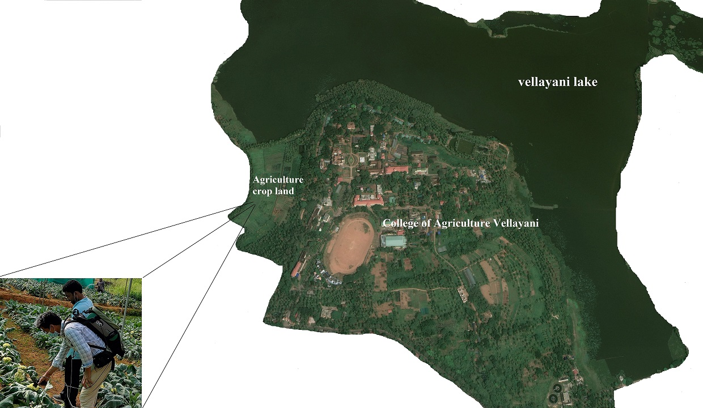
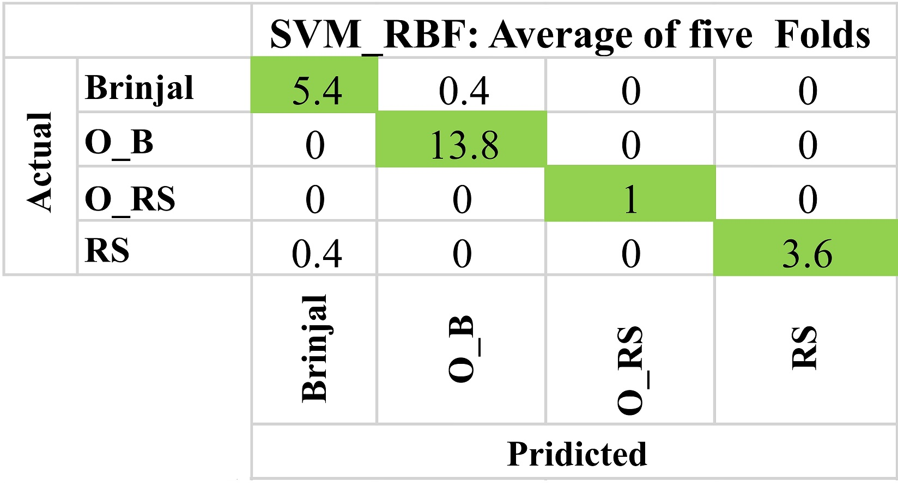

# Spectral-discrimination-of-vegetable-crops-using-in-situ-hyperspectral-data

## Description
. Large scale multi-crop discrimination using airborne, or satellite remote sensing is required for farm level intervention and for decision making by various stake holders such as agriculture insurance companies, risk assessment agencies and local governments. We has assessed the spectral discrimination of as many as 23 different vegetable crops and attempted discriminating a few vegetable crops grown under organic and inorganic crop growing practices. For this, we have applied 12 different statistical and machine learning algorithms establishing the spectral discrimination and assessing its relative stand across the range of crops considered.

## Data Availability
Partial data is provided in the Data folder.

## Workflow

## Location

## Confusion Matrix

## Citation

If you use [Spectral discrimination of vegetable crops and Analysis](https://github.com/manojkaushik/Spectral-discrimination-of-vegetable-crops-using-in-situ-hyperspectral-data) code in your research, we would appreciate a citation to the original IEEE paper:

"*Kaushik, Manoj, et al. "Spectral discrimination of vegetable crops using in situ hyperspectral data and reference to organic vegetables." 2023 International Conference on Machine Intelligence for GeoAnalytics and Remote Sensing (MIGARS). Vol. 1. IEEE, 2023.*"

"*Kaushik, M., Nidamanuri, R. R., Aparna, B., & Ramiya, A. M. (2023, January). Spectral discrimination of vegetable crops using in situ hyperspectral data and reference to organic vegetables. In 2023 International Conference on Machine Intelligence for GeoAnalytics and Remote Sensing (MIGARS) (Vol. 1, pp. 1-4). IEEE.*"

"*Kaushik, Manoj, Rama Rao Nidamanuri, B. Aparna, and A. M. Ramiya. "Spectral discrimination of vegetable crops using in situ hyperspectral data and reference to organic vegetables." In 2023 International Conference on Machine Intelligence for GeoAnalytics and Remote Sensing (MIGARS), vol. 1, pp. 1-4. IEEE, 2023.*"

"*Kaushik, M., Nidamanuri, R.R., Aparna, B. and Ramiya, A.M., 2023, January. Spectral discrimination of vegetable crops using in situ hyperspectral data and reference to organic vegetables. In 2023 International Conference on Machine Intelligence for GeoAnalytics and Remote Sensing (MIGARS) (Vol. 1, pp. 1-4). IEEE.*"

"*Kaushik M, Nidamanuri RR, Aparna B, Ramiya AM. Spectral discrimination of vegetable crops using in situ hyperspectral data and reference to organic vegetables. In2023 International Conference on Machine Intelligence for GeoAnalytics and Remote Sensing (MIGARS) 2023 Jan 27 (Vol. 1, pp. 1-4). IEEE.*"